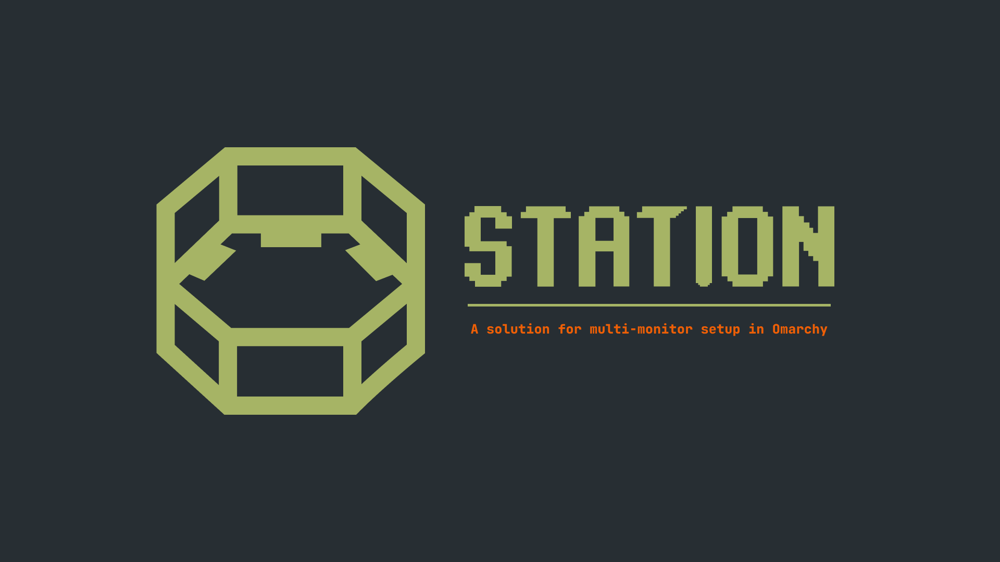

# Station

Station is an Omarchy plugin for intelligent multi-monitor management that:

- **Creates logical workstations** by syncing Hyprland workspaces across your monitors into an abstraction we call a **station**.
- **Switches and moves windows across monitors** with fast, keyboard-driven controls.
- **Handles monitor hot-plugging automatically**, adapting between dual- and single-monitor layouts.
- **Preserves your workspace state and position** when monitors are disconnected or reconnected.
- **Integrates natively with Omarchy**, including the Quattro bar and Hyprland configuration.
- **Provides a powerful CLI** for configuring, controlling, and monitoring your stations directly from the terminal.

> [!INFO]
> Station currently supports dual- and single-monitor operation. `station init` requires exactly two connected monitors so Station can establish the primary/secondary workstation layout.

## What it does

Station pairs Hyprland workspaces two at a time. In dual-monitor mode, each station spans one workspace on your primary monitor and one on your secondary — station 1 is workspaces 1 and 2, station 2 is workspaces 3 and 4, and so on up to station 5.

Switching stations moves both halves together. Directional movement lets you cross station boundaries or move a window between the two monitors within a station.

When you're down to one monitor — either by choice (`station mode single`) or because a monitor was disconnected — Station collapses each station's two workspaces into one on the monitor that remains, without losing which window belonged to which station. Reconnect the second monitor and Station expands back to the dual layout automatically.

The bar indicator (`[S1]`–`[S5]`) shows your current station and follows your active theme. It is only shown in dual-monitor mode; in single-monitor mode there is no station ambiguity, so the indicator stays out of the way.


<div align="center" width="100%">
  <video
    src="https://github.com/user-attachments/assets/f74d1c0c-f4ea-4b0b-a396-f4c87e75d474"
    width="100%"
    controls>
  </video>
</div>

## Requirements

Station targets **Omarchy Quattro (Omarchy 4.x+)** and **Hyprland 0.56.x**.

The installer supports three installation methods. You only need the dependencies for the method you choose:

| Method                    | Required tools                         | What happens                                                                                  |
| ------------------------- | -------------------------------------- | --------------------------------------------------------------------------------------------- |
| **Verified prebuilt**     | `curl` and `sha256sum`                  | Downloads the public release binary and verifies it against the checksum committed in source  |
| **Attested prebuilt**     | Authenticated `gh`, `curl`, `sha256sum` | Performs checksum verification plus GitHub release and build-provenance verification          |
| **Build from source**     | `bun`                                  | Builds the binary locally from the source checkout; no downloaded binary is trusted           |

Additional requirement:

- `station init` requires exactly 2 connected monitors.

The installer checks the supported Hyprland and Omarchy versions before modifying the system.

## Install

Install the plugin through Omarchy:

```bash
omarchy plugin add https://github.com/Yakumy/Station.git --enable
cd ~/.config/omarchy/plugins/yakumy.station
./install.sh
```

Then initialize Station:

```bash
station init
```

`omarchy plugin add` clones the plugin into the live Omarchy plugin directory and enables its bar widget.

`install.sh` verifies the environment, installs the Station binary, installs the Hyprland integration, configures the Omarchy bar widget, and reloads the required components.

If `~/.local/bin/station` or `~/.config/hypr/station-bindings.lua` already exists without being a Station-managed symlink, the installer stops rather than replacing it. See [Security](#security).

`station init` is intentionally separate from installation. Installation does not automatically take control of your workspaces.

## Installation methods

### Prebuilt binary with reviewed checksum

This is the default and recommended installation method. It does not require a
GitHub account, GitHub CLI, or authentication.

When using the prebuilt path, `install.sh`:

1. Reads the Station version from `manifest.json`.
2. Downloads the matching release binary from the `Yakumy/Station` GitHub release.
3. Reads the version-specific checksum committed under `release/checksums/`.
4. Calculates the binary digest with a validated, file-descriptor-pinned
   `sha256sum` executable.
5. Installs the binary only when its digest exactly matches the reviewed
   checksum.

The release workflow cannot attest or publish a binary unless it matches that
same checksum. A missing, malformed, or mismatched checksum causes the installer
to fail closed.

### Optional GitHub attestation verification

Users who want GitHub release-identity and build-provenance verification in
addition to the mandatory checksum check can explicitly select the attested
method:

```bash
STATION_INSTALL_METHOD=attested ./install.sh
```

This optional mode requires an authenticated GitHub CLI. Run `gh auth login`
first. The additional verification policy is equivalent to:

```bash
gh release verify-asset "v<VERSION>" <binary> \
  --repo Yakumy/Station

gh attestation verify <binary> \
  --repo Yakumy/Station \
  --source-ref refs/tags/v<VERSION> \
  --signer-workflow Yakumy/Station/.github/workflows/release.yml \
  --deny-self-hosted-runners
```

A valid attestation from another Station release is not sufficient. The source reference must match the exact release version being installed.

The release workflow builds Station with:

```bash
bun build --compile --minify --bytecode \
  --no-compile-autoload-dotenv \
  --no-compile-autoload-bunfig \
  index.js --outfile bin/station
```

using Bun `1.4.2`.

Compilation runs inside the official Bun Linux/amd64 container pinned to the
architecture-specific OCI digest recorded in `.github/workflows/release.yml`.
The workflow verifies the Bun executable against its reviewed SHA-256 digest,
builds in a fixed location and minimal environment, and requires the output to
match the release checksum committed under `release/checksums/`.

All workflow actions are pinned to immutable commit SHAs. The build job has no
repository write permission; only the separate draft-publication job receives
`contents: write` after the binary has passed digest verification and received
a build-provenance attestation.

The default prebuilt method does not read or require GitHub credentials. In the
optional attested method, the installer extracts only the resulting token and
passes it into an otherwise isolated GitHub CLI environment.

### Build from source

Station can also be built locally from the checked-out source with Bun.

The installer uses the same build command as the release workflow:

```bash
bun build --compile --minify --bytecode \
  --no-compile-autoload-dotenv \
  --no-compile-autoload-bunfig \
  index.js --outfile bin/station
```

The locally generated binary is compiled from the source checkout itself. No prebuilt release binary is downloaded or trusted in this mode.

To explicitly select this method:

```bash
STATION_INSTALL_METHOD=source ./install.sh
```

Bun `1.4.2` is the version used by the project's release workflow.

### Automatic method selection

When no method is forced, `install.sh` uses:

- `curl` and `sha256sum` available → **checksum-verified prebuilt binary**
- otherwise, `bun` available → **local source build**
- neither available → installation stops

You can explicitly select any path:

```bash
STATION_INSTALL_METHOD=prebuilt ./install.sh
STATION_INSTALL_METHOD=attested ./install.sh
STATION_INSTALL_METHOD=source ./install.sh
```

`STATION_INSTALL_METHOD=prebuilt` never requires GitHub authentication. The
installer will not install a prebuilt binary that fails the committed-checksum
verification.

## Build and release provenance

Station's prebuilt release binary is intentionally not committed to the repository.

Release binaries are produced by:

```text
.github/workflows/release.yml
```

For each release tag, the workflow:

1. Checks out the exact tagged source without persisting GitHub credentials.
2. Runs inside the official Bun `1.4.2` Linux/amd64 container pinned by OCI
   digest.
3. Verifies the Bun executable's SHA-256 digest and architecture.
4. Builds in a fixed path with a minimal environment.
5. Requires the binary to match the reviewed checksum committed for the tag.
6. Creates a GitHub artifact build-provenance attestation.
7. Transfers the binary to a separate publication job, compares its checksum
   file with the reviewed tagged source, and verifies the binary again.
8. Uploads the binary and checksum to a draft release using the only job with
   `contents: write`.
9. The maintainer publishes the completed draft after reviewing its assets;
   GitHub then locks its tag and assets under the repository's immutable-release
   policy.

Before publishing any release, enable **Release immutability** in the repository's
GitHub settings. The release workflow also refuses to publish bytes that differ
from the checksum already committed in the tagged source.

The installer verifies the downloaded binary against that reviewed checksum
before replacing the installed binary. GitHub provenance verification remains
available through the explicit `attested` installation method.

The resulting trust chain is:

```text
source commit
    ↓
release tag
    ↓
digest-pinned Bun build container
    ↓
SHA-256-verified Bun compiler
    ↓
compiled binary
    ↓
reviewed binary SHA-256 checksum
    ↓
published release binary
    ↓
installer SHA-256 verification
    ↓
installation
```

CI also publishes an artifact build-provenance attestation for users who select
the optional attested installation method.

The source-build path is an independent alternative for users who prefer to compile locally rather than use a CI-produced binary.

## Reviewer verification

The release version is maintained in `manifest.json`. To determine it without hardcoding a version number:

```bash
VERSION=$(grep -o '"version"[[:space:]]*:[[:space:]]*"[^"]*"' manifest.json \
  | sed -E 's/.*"([0-9]+\.[0-9]+\.[0-9]+)".*/\1/')

echo "$VERSION"
```

Review the source corresponding to the release:

```bash
git clone https://github.com/Yakumy/Station.git
cd Station

VERSION=$(grep -o '"version"[[:space:]]*:[[:space:]]*"[^"]*"' manifest.json \
  | sed -E 's/.*"([0-9]+\.[0-9]+\.[0-9]+)".*/\1/')

git checkout "v$VERSION"
```

Inspect the release workflow and confirm that its actions are pinned:

```bash
sed -n '1,200p' .github/workflows/release.yml
```

Confirm the pinned build image, compiler digest, and reviewed output digest:

```bash
BUN_IMAGE='oven/bun@sha256:296a79bbc988bb0a91ef11099af70a78a8cba98b73fd53f7b2a7715b7c86ced2'

docker run --rm --platform linux/amd64 \
  --entrypoint /bin/bash \
  --volume "$PWD:/review:ro" \
  "$BUN_IMAGE" -c '
    set -euo pipefail
    build_root=/tmp/station-build
    manifest_version="$(sed -nE "s/^[[:space:]]*\"version\":[[:space:]]*\"([0-9]+\.[0-9]+\.[0-9]+)\",?$/\1/p" /review/manifest.json)"
    test -n "$manifest_version"
    mkdir -p "$build_root/source" "$build_root/home" "$build_root/toolchain"
    cp -a /review/. "$build_root/source/"
    ln -s "$(command -v bun)" "$build_root/toolchain/bun"
    echo "a83d263767d839e4d2649ca8e35d07159c7afc99afdc96d731ced29e056dda0c  $(command -v bun)" | sha256sum -c -
    cd "$build_root/source"
    env -i HOME="$build_root/home" LC_ALL=C.UTF-8 \
      PATH="$build_root/toolchain:/usr/bin:/bin" \
      "$build_root/toolchain/bun" build --compile --minify --bytecode \
        --no-compile-autoload-dotenv --no-compile-autoload-bunfig \
        index.js --outfile bin/station
    cp "release/checksums/v${manifest_version}-linux-x64.sha256" bin/station.sha256
    cd bin
    sha256sum -c station.sha256
  '
```

Verify the public release artifact using the default authentication-free policy:

```bash
VERIFY_DIR=$(mktemp -d)
trap 'rm -rf -- "$VERIFY_DIR"' EXIT

curl --fail --location --silent --show-error \
  "https://github.com/Yakumy/Station/releases/download/v$VERSION/station" \
  --output "$VERIFY_DIR/station"

cp "release/checksums/v${VERSION}-linux-x64.sha256" "$VERIFY_DIR/station.sha256"
(cd "$VERIFY_DIR" && sha256sum --check station.sha256)
```

Optionally verify GitHub release identity and build provenance as well:

```bash
gh auth status --hostname github.com

gh release verify-asset "v$VERSION" "$VERIFY_DIR/station" \
  --repo Yakumy/Station

gh attestation verify "$VERIFY_DIR/station" \
  --repo Yakumy/Station \
  --source-ref "refs/tags/v$VERSION" \
  --signer-workflow Yakumy/Station/.github/workflows/release.yml \
  --deny-self-hosted-runners
```

The installer always performs the SHA-256 check. The exact-release provenance
checks are added when `STATION_INSTALL_METHOD=attested` is selected.

## Update

Station does not include a self-updater. Update the plugin through Omarchy,
then rerun its installer to install the matching verified binary:

```bash
omarchy plugin update yakumy.station
cd ~/.config/omarchy/plugins/yakumy.station
./install.sh
```

The installer verifies the release binary against the updated plugin version
before replacing the installed binary.

Your Station configuration — including primary/secondary monitor selection, direction, and current mode — is stored outside the plugin directory and is not replaced by a normal update.

## Uninstall

```bash
station delete
```

This removes the `station` command, saved Station configuration, Hyprland integration, the bar indicator entry, and the plugin itself.

Deletion is also available immediately after installation. You can run
`station delete` even if `station init` has never been run.

If any step cannot be completed automatically, Station prints the exact manual command needed to finish the cleanup.

## Configuration

```bash
station set monitor <name> <primary|secondary>
# Example:
station set monitor HDMI-A-2 primary

station direction <left2right|right2left>
# Print the current direction:
station direction

station mode single <primary|secondary>
station mode dual
```

`station set monitor` requires dual-monitor mode with exactly two monitors connected.

By default, Station selects the monitor positioned at `0x0` as the primary monitor. An explicit monitor selection overrides that default.

## Keybindings reference

| Keys                                              | Action                                                                    |
| ------------------------------------------------- | ------------------------------------------------------------------------- |
| `Ctrl + Super + F1`–`F5`                          | Switch to station 1–5                                                     |
| `Shift + Ctrl + Super + F1`–`F5`                  | Move the active window to station 1–5 and follow it                       |
| `Shift + Super + Alt + F1`–`F5`                   | Move the active window to station 1–5 without following                   |
| `Ctrl + Super + Left / Right`                     | Switch to the previous/next station according to the configured direction |
| `Shift + Ctrl + Super + Left / Right / Up / Down` | Move the active window across station or monitor boundaries               |

These keybindings remain available in single-monitor mode. With one monitor, a station and a Hyprland workspace represent the same logical location.

## Troubleshooting / Recovery

**The indicator isn't showing up.**

The indicator is shown when Station is initialized and running in dual-monitor mode.

Check:

```bash
station status
```

If Station is not initialized, run:

```bash
station init
```

If Station reports single-monitor mode, the missing indicator is expected.

**A mode switch seems to have left windows in the wrong place.**

Check:

```bash
station status
hyprctl workspaces
```

Then re-run the desired mode command:

```bash
station mode dual
```

or:

```bash
station mode single <primary|secondary>
```

Mode transitions are designed to be safe to repeat.

**You unplugged a monitor and things look wrong.**

Station listens for Hyprland monitor add/remove events and reconciles its workspace layout automatically.

To force a manual reconciliation:

```bash
station reconcile
```

**You see a Hyprland error immediately after installation.**

The Station integration is designed to remain inactive until Station is initialized. Run:

```bash
station init
```

If the error remains afterward, open an issue with the exact error text.

**You want to start over without reinstalling.**

```bash
station stop
station init
```

`station stop` disables Station without removing the installation. `station init` reinitializes the Station state and respects a previously selected monitor configuration.

**You want a completely clean reset.**

```bash
station delete
```

Then reinstall:

```bash
omarchy plugin add https://github.com/Yakumy/Station.git --enable
cd ~/.config/omarchy/plugins/yakumy.station
./install.sh
station init
```

## Security

Because the prebuilt installation is only as trustworthy as the tools that verify it, the installer treats tool resolution and shared paths as security boundaries.

**Trusted tool resolution.** `install.sh` discards the caller's `PATH` and resolves `curl`, `sha256sum`, optional `gh`, and `bun` from a fixed, non-ambient search path. It rejects any candidate reachable through a directory owned by another user or writable by group/other. As soon as a tool passes that check, the installer opens a read-only file descriptor on it and invokes it exclusively through that descriptor (via `/proc/self/fd/<n>`) rather than by re-resolving the path — so even if the path, or a directory in its resolution chain, is replaced immediately afterward, the binary that actually runs is the one that was validated. The downloader and verifiers run with a minimal environment, so environment variables cannot redirect or disable verification.

**Verified before installed.** A downloaded binary is staged in a freshly created, randomly named, owner-only directory. Its SHA-256 digest must exactly match the version-specific checksum committed in the reviewed source before it is moved into place, and the move is an atomic rename. A failed verification leaves no binary and no version marker behind. The default path requires no credentials. Optional GitHub verification reduces authentication to a token obtained through the already validated `gh` executable; user configuration is not loaded during verification.

**Immutable build inputs.** Release compilation runs in an architecture-specific Bun container pinned by OCI digest. CI separately verifies the Bun executable digest and requires the compiled output to match a checksum already present in the reviewed source commit. Compilation has no repository write token; publication occurs in a separate job only after verification and attestation.

**Deterministic runtime configuration.** Release and source builds disable Bun's compiled-executable loading of `.env` and `bunfig.toml`, so running Station from an untrusted working directory cannot inject environment settings or preload JavaScript into the Station process.

**Shared paths are never clobbered blindly.** `~/.local/bin/station` and `~/.config/hypr/station-bindings.lua` are only replaced when they are symlinks that point exactly at the installed plugin files. If either path exists as an unrelated file or symlink, the installer stops and explains what it found instead of overwriting it. `hyprland.lua` is only modified when it is a regular file, and any change is written atomically.

**Ambient execution state is constrained.** A `curl`, `sha256sum`, `gh`, `bun`, `hyprctl`, or `omarchy` placed earlier in your shell `PATH` is not consulted. Installer trust tools run with an empty temporary home and configuration directory; runtime tools receive only the small environment allowlist needed to communicate with Hyprland and Omarchy. Omarchy receives the fixed, validated `/usr/share/omarchy` installation root rather than an inherited `OMARCHY_PATH`.

## License

Apache License 2.0 — see [LICENSE](./LICENSE).
